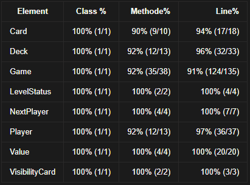

         _________ __                 __         
        /   _____/|  | __ ___.__.    |__|  ____  
        \_____  \ |  |/ /<   |  |    |  | /  _ \ 
        /        \|    <  \___  |    |  |(  <_> )
       /_______  /|__|_ \ / ____|/\__|  | \____/ 
               \/      \/ \/     \______|        
			  
			  
##README

	Le principe du projet est de recoder le principe du jeu de 
	carte Skyjo pour 2 joueurs.en java avec une interfaces 
	graphique a l' aide de javafx en respectant le shema model
	view controlleur et en implementent un observateur observer.
	
	Skyjo est un jeu dont l’objectif est d’obtenir le moins de
	points possibles en inversant et échangeant des cartes. 
	Chaque joueur possède 12 cartes dont la valeur varie de 
	-2 à 12. La description des règles du jeu est disponible 
	via https://www.regledujeu.fr/regle-du-skyjo.
	
##Regles du jeu
	
	Début d’une partie
	    
        Lorsqu’une manche démarre, deux cartes ont été retournées 
	    pour chaque joueur. Le joueur avec le plus de points commence.
	    Si les deux joueurs ont le même nombre de points, choisissez 
	    au hasard.
	
	Déroulement d’une manche

	    Le premier joueur doit choisir entre les deux actions suivantes :
	    	. piocher la défausse ;
	    	. retourner une carte de la pioche.

	    Si le joueur choisit de piocher une carte de la défausse, il doit
	    échanger la carte défaussée avec une de ses cartes. Il peut 
	    l’échanger contre n’importe laquelle de ses cartes,qu’elle soit 
	    face visible ou face cachée. Lorsqu’il procède à cet échange, il 
	    rend la carte échangée face visible sur la pile de défausse.
	
	    Si le joueur choisit de retourner une carte de la pioche, il peut
	    reposer la carte tirée sur la pile de défausse (face visible) et
	    retourner une de ses cartes dont la valeur était cachée OU il peut
	    échanger la carte piochée avec n’importe laquelle de ses cartes.

	    Lorsqu’il procède à cet échange, le joueur dépose son ancienne carte 
	    face visible sur la défausse.
	    Après cette action, le nombre de points du joueur est mis à jour et 
	    le joueur suivant peut jouer.
	
	Fin d’une manche

	    Une manche se décompose en plusieurs tours. Chaque tour permettant 
	    aux deux joueurs d’effectuer leurs actions. Une manche se termine 
	    lorsqu’un des deux joueurs a retourné toutes ses cartes. Si le premier
	    joueur du tour a retourné toutes ses cartes, le second joueur doit 
	    encore effectuer son action. C’est seulement à la fin de ce tour que
	    la manche est terminée.
	
	Fin du jeu

	    Si le joueur qui a terminé en premier a un score plus grand ou égal
	    au score de l’autre joueur et si son score est positif, une pénalité
	    lui est attribuée : ses points sont doublés.

Soyez audacieux dans vos décisions !
Skyjo propose des règles simples, un jeu rapide et prenant
	, et sera sujet de moult revanches !

##info utile 
	
couverture des test 

